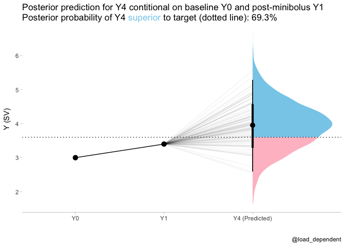

Fluid responsiveness simulation
================

Simulation of fluid responsiveness prediction trial, by mini-fluid
boluses, using predictions from a bayesian linear model.

[Shiny app for interactive
simulation](https://lmsaxhaug.shinyapps.io/fluid_response_sim/)

Simulate data, based on
[this](https://discourse.datamethods.org/t/calculating-correlation-between-consecutive-changes-dealing-with-spurious-correlation/4528/6)
[datamethods.org](datamethods.org) discussion

``` r
set.seed(1349)

n <- 1000
# true values
Y0 <- rnorm(n, 5, 1)

a <- rnorm(n, 0, 1) # change
Y1 <- Y0 + a/2
Y4 <- Y1 + a

# add independent random noise
Y0 <- Y0 + rnorm(n, 0, 0.2)
Y1 <- Y1 + rnorm(n, 0, 0.2)
Y4 <- Y4 + rnorm(n, 0, 0.2)
df <- tibble(Y0,Y1,Y4)
```

Fit models, using flat priors (for simplicity)

``` r
model1 <- brm(Y4 ~ 0 + Y0 + Y1,
          data = df,
          file = here("fluid_response","model1.Rds"),
          file_refit= "on_change"
          )
model1
```

    ##  Family: gaussian 
    ##   Links: mu = identity; sigma = identity 
    ## Formula: Y4 ~ 0 + Y0 + Y1 
    ##    Data: df (Number of observations: 1000) 
    ## Samples: 4 chains, each with iter = 2000; warmup = 1000; thin = 1;
    ##          total post-warmup samples = 4000
    ## 
    ## Population-Level Effects: 
    ##    Estimate Est.Error l-95% CI u-95% CI Rhat Bulk_ESS Tail_ESS
    ## Y0    -1.37      0.04    -1.45    -1.30 1.00     1113     1332
    ## Y1     2.37      0.04     2.30     2.45 1.00     1114     1299
    ## 
    ## Family Specific Parameters: 
    ##       Estimate Est.Error l-95% CI u-95% CI Rhat Bulk_ESS Tail_ESS
    ## sigma     0.68      0.02     0.65     0.71 1.00     1789     1476
    ## 
    ## Samples were drawn using sampling(NUTS). For each parameter, Bulk_ESS
    ## and Tail_ESS are effective sample size measures, and Rhat is the potential
    ## scale reduction factor on split chains (at convergence, Rhat = 1).

New values for Y0 and Y1 to predict Y4 from, and minimum SV to target

``` r
Y0_new <- 3.0
Y1_new <- 3.4
Y4_target <- 3.6 #minimum co target
```

Generate posterior predictions based on Y0 and Y1

``` r
prediction <- tibble(Y0=Y0_new,Y1=Y1_new) %>%
  add_predicted_draws(model1)

head(prediction)
```

    ## # A tibble: 6 x 7
    ## # Groups:   Y0, Y1, .row [1]
    ##      Y0    Y1  .row .chain .iteration .draw .prediction
    ##   <dbl> <dbl> <int>  <int>      <int> <int>       <dbl>
    ## 1     3   3.4     1     NA         NA     1        4.51
    ## 2     3   3.4     1     NA         NA     2        4.75
    ## 3     3   3.4     1     NA         NA     3        3.80
    ## 4     3   3.4     1     NA         NA     4        4.00
    ## 5     3   3.4     1     NA         NA     5        4.14
    ## 6     3   3.4     1     NA         NA     6        2.92

Calculate posterior probability of Y4 superior to target

``` r
post_pred_prob <- prediction %>%
  summarise(prob=mean(.prediction>Y4_target)) %>%
  pull(prob)
```

    ## `summarise()` has grouped output by 'Y0', 'Y1'. You can override using the `.groups` argument.

Data for points and lines

``` r
plot_data = tibble(time=ordered(c("Y0","Y1","Y4")),y=c(Y0_new,Y1_new,mean(prediction$.prediction)),group="group")
```

``` r
plot_data %>%
  ggplot(aes(x = time, y = y,group="group")) +
  stat_halfeye(aes(y = .prediction, x = "(Predicted) Y4", fill = after_stat(ifelse(y > Y4_target, "over", "under"))), data = prediction) +
  geom_point(size=3)+
  geom_path()+
  geom_hline(yintercept = Y4_target,linetype="dotted")+
  scale_fill_manual(values = c("over" = "#87ceeb", "under" = "#FFC0CB")) +
  scale_y_continuous(name = "Y (SV)")+
  scale_x_discrete(name="")+
  theme_tidybayes() +
  labs(title = paste0(
    "Posterior prediction for Y4 contitional on baseline Y0 and post-minibolus Y1 <br>",
    "Posterior probability of Y4 <span style='color:#87ceeb;'>superior</span> to target (dotted line): ", scales::percent(post_pred_prob, accuracy = .1)
  )) +
  theme(
    legend.position = "none", axis.line.y = NULL,
    plot.title = element_markdown(lineheight = 1.1),
    legend.text = element_markdown(size = 11)
  )
```

<!-- -->
